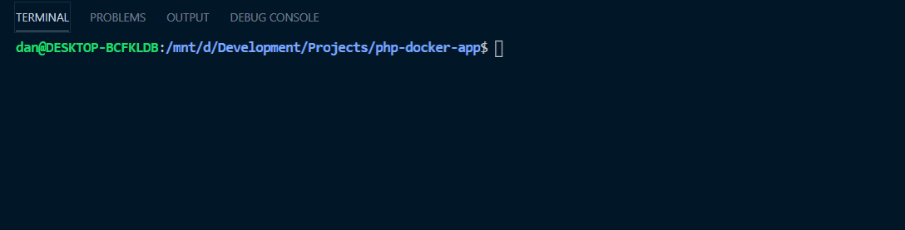
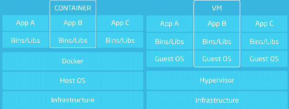

Docker is a tool that I have recently been using at work and it has changed, to such a significant degree, the way in which I approach setting up my development projects that I wanted to take a look at it in more detail for my next article.

Docker started appearing on my radar, in my previous life as a Technical Recruiter, somewhere around late 2017... I think. I hadn't been actively recruiting into the space but many of my colleagues did in some way shape or form and by the time I had left the industry late last year, I would say it had easily over a 60-70% market capitalisation of the UK tech market. This number steadily rises, the larger the category of organisations you look at, as economies of scale start to kick in and organisations are able to realise the efficiencies of working in a containerised environment more effectively.

The long and short of it is that, a lot of companies are using the tool. If you're looking to increase your market value as a Developer then learning how to use Docker is a good way of spending an hour or two of your time. Plus, once you've set this up, it's so incredibly fast and easy to set up new projects to start hacking away on.

## Docker v Vagrant
So why use Docker over some existing tools like Vagrant?

I originally used Vagrant to set up my VM's before moving to Docker. There's nothing wrong with Vagrant and it solves the "well, it worked on my machine" problem absolutely fine. The difference really becomes apparent when you start looking at the **speed** and **resource utilisation** difference between the two.

**- Speed**
The difference in speed is noticeable between the two. We're talking the difference between seconds and minutes here. Once you have setup your images and containers the first time round, Docker makes clever use of caching to enable you to tear down all your running Docker containers for a project then re-create all of them in around 1, maybe 2 seconds. I used to go and make myself a coffee when Vagrant would start up.



**-Resource Utilisation**
The amount of resources Vagrant uses compared to Docker is really noticeable too. Every time I would spin up a new Vagrant VM, the physical space alone would amount to 3-4GB, if not more, per VM. This really starts to add up once you start running multiple projects.



The image above is a good representation of the two approaches. The issue with Vagrant is that when you spin up a new VM, you have to host a whole new version of the OS. Where as in Docker, you remove that overhead. You can host one OS for your Docker instance and then host as many Docker containers on top as you want.

## What are we going to build exactly?
Originally, my plan was to walk through step-by-step how to install Docker, pull the base images from Docker Hub, create your Dockerfile, build the images, commit the changes, create a docker-compose file and then some bash scripts to streamline some of the develop workflow. Similar to the two-part series I created on [building a portfolio and blog using Gatsby, Tailwind CSS and MDX here](https://www.danielnorris.co.uk/blog/posts/how-to-build-a-portfolio-using-gatsby-part-1/).

The honest truth is, it took hours to write that series and I haven't had the time available at the moment with a new job but I have done the next best thing. I've tidied up and packaged my Docker setup that I use for Laravel, uploaded the base images to Docker Hub and added some additional bash scripts so that it streamlines the installation workflow for you. Which means you should have a fully functioning Docker setup to hack away on in a little less than 5 minutes!

Here's what you'll be setting up:

- a Nginx server
- Ubuntu 18.04
- MySQL 5.7
- PHP 7.2
- Laravel 7.x (*optional*)
- Node (*optional*)
- Redis 5.0.x (*optional*)

What this isn't going to cover is how you can go about creating this from scratch yourself, but I will include some pointers on where you can look if you want to omit some of the optional tools above or even change the version of software you are using in your setup.

## What is Docker?
Docker is very simply, a tool that manages containers.

Containerisation is a functionality that was already native to Linux. Docker effectively acts like an API for this functionality that is already available in the Linux ecosystem and enable you to encapsulate your code and OS separately. You can have as many containers running simultaneously and side by side without them interferring with each other.

This enables you to chop and change your Docker containers for use with different use cases without having to start rebuilding your entire environment from scratch again.

There are four additional layers to Docker that are worthwhile noting:

### Images
Images are what you start with in your Docker workflow. I've regularly seen them referred to like a class in Object Orientated Programming and when instantiated, the instantiated object becomes a **container** which we'll look at shortly. In order for you to make a container, you need to either pull a base image from a public repository for Docker images like Docker Hub or create one based on a `Dockerfile`. We'll be using both methods shortly.

### Container
From your image, you can build a container. Again, a better way of thinking about this is comparing it to instantiating an object from a class. but they are not persistent. When your containers are stopped or removed any data created in the container is lost and so you need a way to keep data across sessions and also ensure they are capable of being shared across multiple containers.

### Volume
Volumes are the solution to the problem above and enable us to share data across containers and ensure data is persistent. We'll use a `docker-compose.yml` file to create volumes for both our MySQL and Redis data stores and enable our data to persist across sessions and become accessible across multiple containers.

### Network
The last key component to your Docker setup is the network. A network enables containers to communicate with each other. By default this isn't enabled but it is easy to setup and again, we'll use our `docker-compose.yml` file to do this.

## Getting started

### Prerequisites

You'll need Docker installed to follow this. We won't cover it here but there is well documented installation instructions for:

- macOS
- Windows
- Linux platforms

You can find more information on the docs [here](https://docs.docker.com/engine/install/).

### Clone the docker-compose and Dockerfile

Let's start off by cloning the base `Dockerfile` and `docker-compose.yml` files I have already prepared for you.

```
git clone git@github.com:daniel-norris/docker-php-setup.git <projectdir>
```

Now open your project folder.

```
cd <projectdir>
```

If you open `docker/app/Dockerfile` you can take a look at how the image responsible for PHP, Nginx and the Linux OS Ubuntu was created. You'll pull this completed image directly from Docker Hub shortly which will save you time building it and then committing the changes. However, from looking at the `Dockerfile` you can see that it basically consists of a series of commands.

It starts with choosing a base image which it pulls from Docker Hub; in this case `ubuntu:18.04`. Then runs a series of linux commands to install things like PHP, Composer, a series of config files for php-fpm, the Nginx server and a shell script to start the container.

Go back to the root folder of your project and let's make the `develop` file executable.

```
chmod +x develop
```

If you open the `develop` file and take a look inside, what you'll see is that it's a simple shell script that helps to abstract some of the Docker commands you would need to ordinarily run and helps you make your developer workflow a lot smoother.

### Change your environment variables
Before we go ahead and hit "install", we need to set some environment variables for your MySQL database. Let's do that now.

Open your `docker-compose.yml` file and edit the following variables under the `db` hostname.

```bash
environment:
    MYSQL_ROOT_PASSWORD: # pass for root user
    MYSQL_DATABASE: # database name
    MYSQL_USER: # username
    MYSQL_PASSWORD: # password
```

### Install Laravel
We can use the earlier shell script to simplify this process. Run the following, make sure you are in the root directory of your project.

```
./develop install
```

Then run this to clean up unnecessary folders.

```
./develop clean
```

### Update your `.env` file
You'll need to now update your `.env` file with the values you originally entered in the `docker-compose.yml` file. Enter them here without the angled brackets.

```bash
DB_CONNECTION=mysql
DB_HOST=db
DB_PORT=3306
DB_DATABASE=<MYSQL_DATABASE>
DB_USERNAME=<MYSQL_USER>
DB_PASSWORD=<MYSQL_PASSWORD>
```

Now update your `docker-compose.yml` file so that it substitutes values from your .env file as variables.

```bash
MYSQL_DATABASE: ${DB_DATABASE}
MYSQL_USER: ${DB_USERNAME}
MYSQL_PASSWORD: ${DB_PASSWORD}
```

Now you can start your Docker setup. This will take a little while the first time because you need to download the base images for Node, Redis, PHPMyAdmin, etc.

```
./develop start
```

Then migrate your Laravel database migrations.

```
./develop migrate
```

Install npm dependencies and compile.

```
./develop npm install
./develop npm run dev --watch
```

Now if you go to `localhost:8080` and `localhost:8090`. You'll be able to view your Laravel home page and login to PHPMyAdmin using your MySQL username and password.

## Useful Commands
Now that everything is working, you can take a look around your Docker setup.

Let's firstly take a look at all of the currently active running containers across our project.

```
docker ps
```

Let's now look at all of the images that we have installed across all Docker environments.

```
docker images ls
```

Now, the networks and volumes...

```
docker volume ls
docker network ls
```

## Summary

That's it! 🎉

Now when you need to start or stop your containers. All you need to do is run either:

```
./develop start
./develop stop
```

You should now have a fully functioning LEMP environment running thanks to Docker. If you haven't amended the `docker-compose.yml` file, then you will also have a Node container running and a Redis container for caching.

If you've found this series helpful, you can show your appreciation by leaving a ⭐ on the GitHub repository [here](https://github.com/daniel-norris/docker-php-setup). You can also connect with me on Twitter at [@danielpnorris](https://twitter.com/danielpnorris) for more content related to technology.
